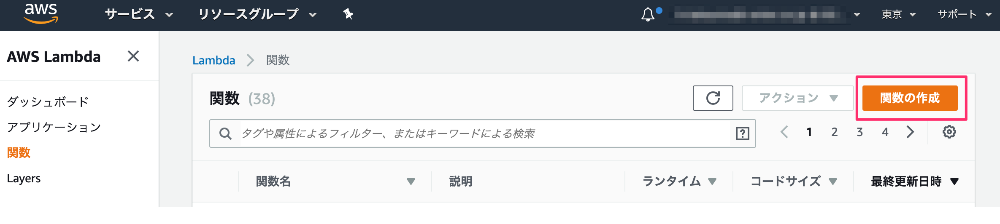
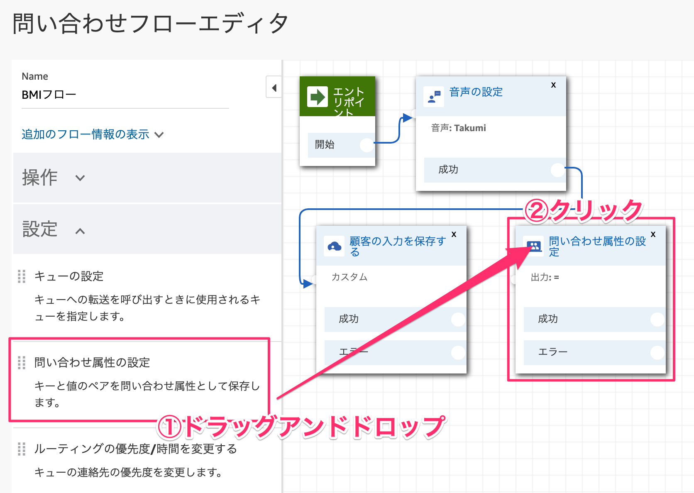
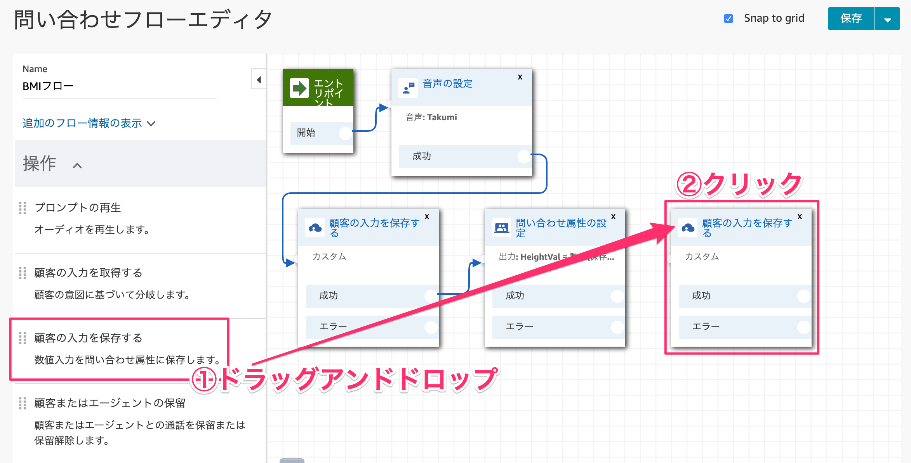
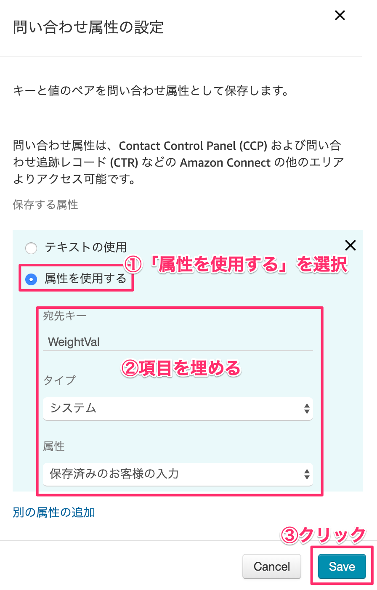
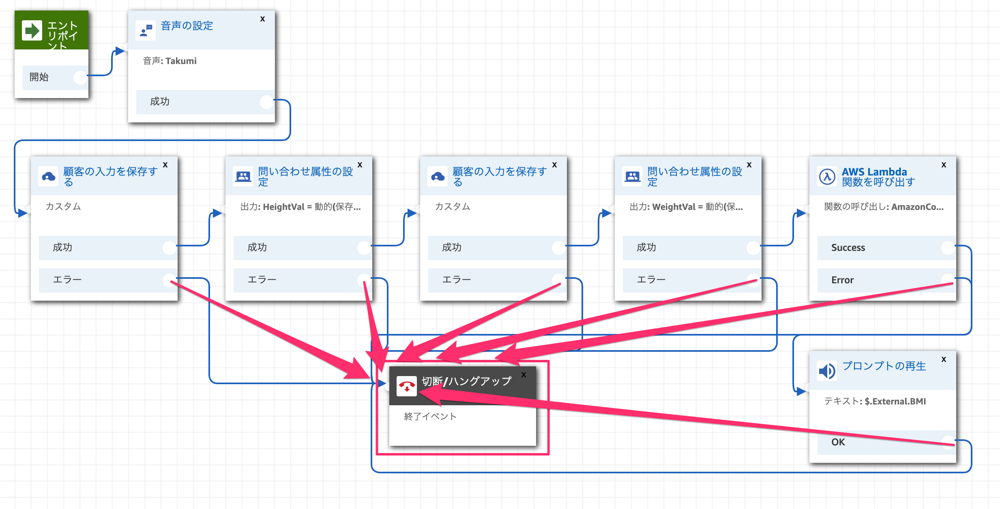

# Amazon Connectハンズオン 02

## Lambda関数を作ろう！
### 1-1. Lambda関数を作成する
サービス部分をクリックしてメニューを展開します。そこの検索窓に「Lambda」と入力します。


［関数の作成］ボタンをクリックします。



各項目を埋めて、［関数の作成］ボタンをクリックします。

| 項目       |       値 |
|:-----------------|:------------------|
|①関数名|AmazonConnect-BMI|
|②実行ロール|AWSポリシーテンプレートから新しいロールを作成|
|③ロール名|AmazonConnect-Role|
|④ポリシーテンプレート|シンプルなマイクロサービスのアクセス権限|


index.jsを全て下記に書き換えます。書き換えたら右上の［保存］ボタンをクリックします。


```javascript:index.js
exports.handler = async (event) => {
    // 身長と体重を取得する
    const heightVal = event.Details.ContactData.Attributes.HeightVal;
    const weightVal = event.Details.ContactData.Attributes.WeightVal;
    
    // BMI計算
    const bmiVal = (parseFloat(weightVal) / (parseFloat(heightVal)/100 * parseFloat(heightVal)/100)).toFixed(1);

    // 標準体重
    const stdWeight = (22 * (parseFloat(heightVal)/100 * parseFloat(heightVal)/100)).toFixed(1);

    var speechText = `あなたのBMIは${bmiVal}です。標準体重は${stdWeight}kgです。`;

    return {"BMI": speechText};
};
```

## LambdaをAmazon Connectに適用しよう！
### 2-1. LambdaをAmazon Connectに適用する
サービスを展開して、検索窓に「Amazon Connect」と入力してクリックします。


左側メニューから「問い合わせフロー」をクリックします。


AWS Lambdaの項目までスクロールして、関数のプルダウンメニューから「AmazonConnect-BMI」の関数を選択します。
選択したら、［追加］ボタンをクリックします。


左側メニューから「概要」をクリックします。［管理者としてログイン］をクリックします。


### 2-2.問い合わせフローの作成
［問い合わせフローの作成］をクリックします。


名前を「BMIフロー」と入力します。


設定カテゴリにある「音声の設定」ブロックをドラッグアンドドロップして、ドロップしたブロックをクリックします。


言語は「日本語」でお好きな音声を選択してください。


エントリポイントと音声の設定ブロックを繋げます。


操作カテゴリの「顧客の入力を保存する」をドラッグアンドドロップしてクリックします。


「テキストの読み上げ」を選択し、発話する内容を入力します。身長の桁数は3桁なので、最大桁数は3桁に設定します。


ブロックを繋げます。


設定カテゴリにある「問い合わせ属性の設定」をドラッグアンドドロップします。



「属性を使用する」を選択し、項目を埋めていきます。
宛先キーは大文字小文字に気をつけてください。

| 項目       |       値 |
|:-----------------|:------------------|
|宛先キー|HeightVal　※大文字小文字は一致させてください|
|タイプ|システム|
|属性|保存済みのお客様の入力|


ブロックを繋げます。


操作カテゴリの「顧客の入力を保存する」をドラッグアンドドロップします。



「テキストの読み上げ機能」を選択し、発話する内容を入力します。体重の最大桁数は3桁にします。


ブロックを繋げます。


設定カテゴリにある「問い合わせ属性の設定」をドラッグアンドドロップします。


「属性を使用する」を選択し、項目を埋めていきます。
宛先キーは大文字小文字に気をつけてください。

| 項目       |       値 |
|:-----------------|:------------------|
|宛先キー|WeightVal　※大文字小文字は一致させてください|
|タイプ|システム|
|属性|保存済みのお客様の入力|



ブロックを繋げます。


統合カテゴリにある「AWS Lambda 関数を呼び出す」をドラッグアンドドロップします。


関数は先程作成した「AmazonConnect-BMI」を選択します。


ブロックを繋げます。


操作カテゴリの「プロンプトの再生」をドラッグアンドドロップします。


「テキストの読み上げ機能」を選択し、下記コードを入力します。
Lambdaから帰ってくるbodyは「$.External」に格納されます。

```
$.External.BMI
```


ブロックを繋げます。


終了カテゴリーの「切断/ハングアップ」をドラッグアンドドロップします。


未接続のノードを全て「切断/ハングアップ」ブロックに繋げます。



右上の［保存して発行］ボタンをクリックします。


左側メニューのルーティングから［電話番号］をクリックします。


電話番号をクリックします。


問い合わせフローを作成した「BMIフロー」を選択します。


これで電話番号かけて、身長と体重の値を入力すればBMI値が返ってきます。

## DynamoDBと連携しよう！
### 3-1. テーブルを作成する
サービスから「DynamoDB」を検索してクリックします。


［テーブルの作成］ボタンをクリックします。


テーブル名とプライマリキーを入力して［作成］ボタンをクリックします。

| 項目       |       値 |
|:-----------------|:------------------|
|テーブル名|PhoneHistory|
|プライマリキー|Timestamp|


Lambda画面を開いて、新しいファイルを新規作成します。［＋］ボタンをクリックし、［New File］をクリックします。


下記コードを入力します。

```javascript:util.js
'use strict';
const AWS = require('aws-sdk');
const DynamoDB = new AWS.DynamoDB.DocumentClient({
  region: "ap-northeast-1"
});

// 日付フォーマット変更
module.exports.dateToStr12HPad0 = function dateToStr12HPad0(date, format) {
    if (!format) {
        format = 'YYYY/MM/DD hh:mm:dd AP';
    }
    format = format.replace(/YYYY/g, date.getFullYear());
    format = format.replace(/MM/g, ('0' + (date.getMonth() + 1)).slice(-2));
    format = format.replace(/DD/g, ('0' + date.getDate()).slice(-2));
    format = format.replace(/hh/g, ('0' + date.getHours()).slice(-2));
    format = format.replace(/mm/g, ('0' + date.getMinutes()).slice(-2));
    format = format.replace(/ss/g, ('0' + date.getSeconds()).slice(-2));
    format = format.replace(/dd/g, ('0' + date.getMilliseconds()).slice(-3));
    return format;
};

// 着信履歴を残す
module.exports.putPhoneNo = async function putPhoneNo(phoneNo) {
    // テーブル名取得
    const tableName = process.env.TABLE_NAME;
    
    var timezoneoffset = -9;     // UTC-表示したいタイムゾーン(単位:hour)。JSTなら-9
    var today = new Date(Date.now() - (timezoneoffset * 60 - new Date().getTimezoneOffset()) * 60000);

    const timestamp = this.dateToStr12HPad0(today, 'YYYY/MM/DD hh:mm:ss:dd');

    // DynamoDBにデータを保存する
    await DynamoDB.put( {
        "TableName": tableName,
        "Item": {
          "Timestamp": timestamp,
          "phoneNo": phoneNo
        }
    }, function( err, data ) {
        console.log(err);
        
    }).promise();
};
```

キーボードのコントロール+Sキーでファイルを保存します。ファイル名は「util.js」にして［Save］ボタンをクリックします。


環境変数を設定します。

| 項目       |       値 |
|:-----------------|:------------------|
|キー|TABLE_NAME|
|値|PhoneHistory|


index.jsのソースを編集します。

```javascript
// utilファイルを読み取り
const Util = require('util.js');

exports.handler = async (event) => {
    
    // 発信者番号
    const phoneNumber = event.Details.ContactData.CustomerEndpoint.Address;

    // 発信者番号をDynamoDBに記録
    await Util.putPhoneNo(phoneNumber);

    // 身長と体重を取得する
    const heightVal = event.Details.ContactData.Attributes.HeightVal;
    const weightVal = event.Details.ContactData.Attributes.WeightVal;
    
    // BMI計算
    const bmiVal = (parseFloat(weightVal) / (parseFloat(heightVal)/100 * parseFloat(heightVal)/100)).toFixed(1);

    // 標準体重
    const stdWeight = (22 * (parseFloat(heightVal)/100 * parseFloat(heightVal)/100)).toFixed(1);

    var speechText = `あなたのBMIは${bmiVal}です。標準体重は${stdWeight}kgです。`;

    return {"BMI": speechText};
};
```


これでAmazon Connectの電話にかけてBMIの返答が返ってきたら、DynamoDBに発信者の電話番号が記録されます。


